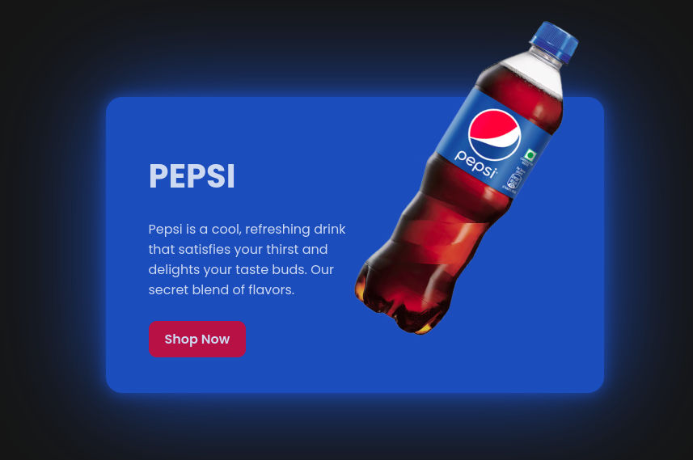

# PepsiCard

Este repositório contém um projeto de interface de usuário para um cartão de produto da Pepsi.

## Tecnologias Utilizadas

&nbsp;
&nbsp;

## Estrutura do Projeto

O projeto é composto pelos seguintes arquivos:

- `index.html`: Arquivo principal que contém a estrutura HTML da página.
- `style.css`: Arquivo de estilos que define a aparência da página.
- `favicon.ico` e `favicon.png`: Ícones utilizados como favicon da página.
- `image.png` e `image1.png`: Imagens utilizadas no conteúdo da página.

## Funcionamento

Ao abrir o arquivo `index.html` em um navegador web, a página exibirá um cartão de produto da Pepsi estilizado conforme as definições presentes no `style.css`.  
As imagens `image.png` e `image1.png` são incorporadas ao conteúdo para ilustrar o produto.  
Os favicons `favicon.ico` e `favicon.png` são utilizados pelo navegador para exibir o ícone da página na aba do navegador ou na barra de favoritos.

## Como Visualizar

1. Clone ou faça o download deste repositório.
2. Abra o arquivo `index.html` em seu navegador de preferência.

Isso permitirá que você visualize a interface do cartão de produto da Pepsi conforme desenvolvida neste projeto.
